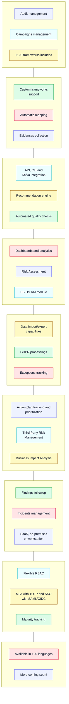

# features

```mermaid
flowchart TB
  %% Overall layout direction
  %% (Subgraphs use LR to form "rows")
  %% Colors: rotate c1..c5 regardless of feature type

  subgraph R1[ ]
    direction LR
    f1[Audit management]:::c1
    f2[Campaigns management]:::c2
    f3[+100 frameworks included]:::c3
  end

  subgraph R2[ ]
    direction LR
    f4[Custom frameworks<br/>support]:::c4
    f5[Automatic mapping]:::c5
    f6[Evidences collection]:::c1
  end

  subgraph R3[ ]
    direction LR
    f7[API, CLI and<br/>Kafka integration]:::c2
    f8[Recommendation engine]:::c3
    f9[Automated quality checks]:::c4
  end

  subgraph R4[ ]
    direction LR
    f10[Dashboards and analytics]:::c5
    f11[Risk Assessment]:::c1
    f12[EBIOS RM module]:::c2
  end

  subgraph R5[ ]
    direction LR
    f13[Data import/export<br/>capabilities]:::c3
    f14[GDPR processings]:::c4
    f15[Exceptions tracking]:::c5
  end

  subgraph R6[ ]
    direction LR
    f16[Action plan tracking and<br/>prioritization]:::c1
    f17[Third Party Risk<br/>Management]:::c2
    f18[Business Impact Analysis]:::c3
  end

  subgraph R7[ ]
    direction LR
    f19[Findings followup]:::c4
    f20[Incidents management]:::c5
    f21[SaaS, on-premises<br/>or workstation]:::c1
  end

  subgraph R8[ ]
    direction LR
    f22[Flexible RBAC]:::c2
    f23[MFA with TOTP and SSO<br/>with SAML/OIDC]:::c3
    f24[Maturity tracking]:::c4
  end

  subgraph R9[ ]
    direction LR
    f25[Available in +20 languages]:::c5
    f26[More coming soon!]:::c1
  end

  %% Optional very-light ordering nudges between rows (no arrows)
  R1 --- R2
  R2 --- R3
  R3 --- R4
  R4 --- R5
  R5 --- R6
  R6 --- R7
  R7 --- R8
  R8 --- R9

  %% Color classes (rotate 5 colors)
  classDef c1 fill:#eef2ff,stroke:#6366f1,stroke-width:1px,color:#0f172a;
  classDef c2 fill:#ecfeff,stroke:#06b6d4,stroke-width:1px,color:#0f172a;
  classDef c3 fill:#fef9c3,stroke:#a16207,stroke-width:1px,color:#0f172a;
  classDef c4 fill:#dcfce7,stroke:#16a34a,stroke-width:1px,color:#0f172a;
  classDef c5 fill:#ffe4e6,stroke:#e11d48,stroke-width:1px,color:#0f172a;
```
