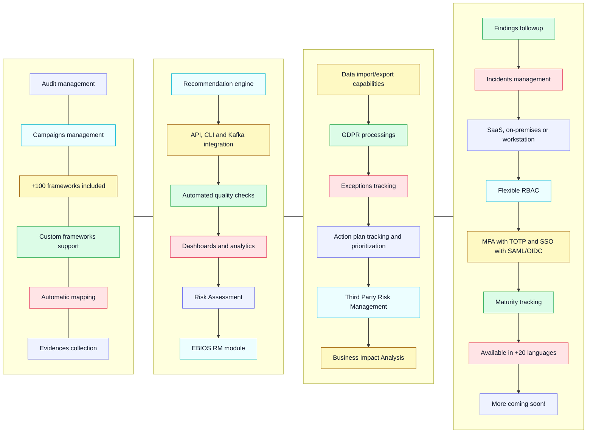

# features

| Compliance                      | Risk                          | Governance               | SecOps                     | Core                         | More                                          |
| ------------------------------- | ----------------------------- | ------------------------ | -------------------------- | ---------------------------- | --------------------------------------------- |
| Audit management                | Risk assessments and register | Policies                 | Incidents management       | Action plan tracking         | Data import wizard                            |
| Campaigns management            | Ebios RM module               | Exceptions management    | findings tracking          | Assets management            | Recommendation engine                         |
| +100 frameworks included        | Risk acceptance workflows     | Reports generation       | Vulnerabilities management | Dashboards and analytics     | KAFKA integration                             |
| Custom frameworks supported     | Third Party Risk Management   | Projects and intiatives* | Periodic checks            | Rest API (swagger available) | Automated quality check (x-rays)              |
| Automatic mapping               | Business Impact Analysis      | Custom KPI/KRI*          |                            | CLI  (automation)            | Single domain export/import (for consultants) |
| Evidences management            | Cyber Risk Quantification*    |                          |                            | Flexible RBAC                | MCP support                                   |
| GDPR processings                |                               |                          |                            | MFA with TOTP                | Email notifications                           |
| Project security questionnaires |                               |                          |                            | SSO with SAML/OIDC           | Available in +20 languages                    |
|                                 |                               |                          |                            | n8n node* (automation)       |                                               |

